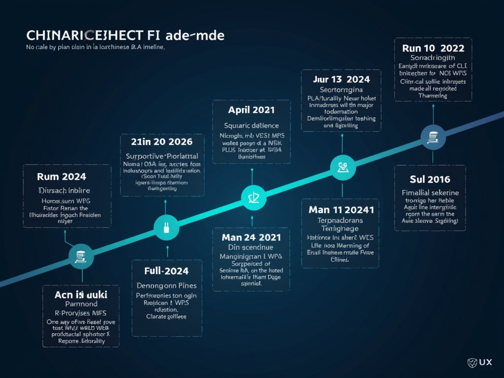

# China’s 2024‑2026 AI Model Surge & The Rise of Agentic AI Phones
## The Recent Wave of Chinese Large‑Language Model Releases

*Timeline of Chinese AI model releases*
## Alibaba Cloud’s Qwen 2.5: Scale, Open‑Source Access, and Benchmarks
## Baidu’s ERNIE 4.5 & X1 Reasoning Model: Capabilities and Open Access
## Tencent Hy3: A New Contender Powered by Ex‑OpenAI Expertise
## Huawei’s Ascend Processors & MindSpore 2.3: Enabling On‑Device Generative AI
## China’s First Agentic AI Phones: Features, Benchmarks, and Early Edge Cases

*Architecture of agentic AI phones*
## Strategic Implications: Global Competition, Cost, and Privacy in China’s AI Surge
> **[IMAGE GENERATION FAILED]** China AI market share
>
> **Alt:** China AI Market Share
>
> **Prompt:** Create a graph showing the growing market share of Chinese AI vendors in the global AI landscape
>
> **Error:** Client error '402 Payment Required' for url 'https://router.huggingface.co/fal-ai/fal-ai/flux/dev' (Request ID: Root=1-6a6c9bfb-7ed106ee775a84d51417aa5d;fbb7ebee-843d-4887-b772-9c9d23d2b1da)
For more information check: https://developer.mozilla.org/en-US/docs/Web/HTTP/Status/402

You have depleted your monthly included credits. Purchase pre-paid credits to continue using Inference Providers. Alternatively, subscribe to PRO to get 20x more included usage.
